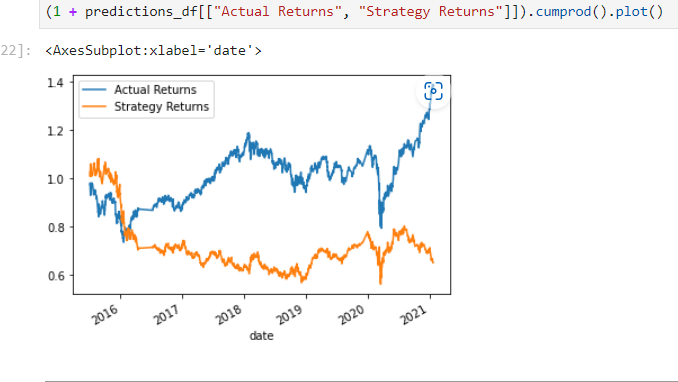
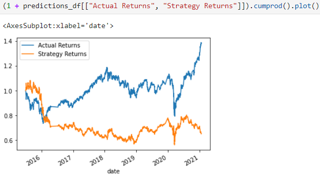
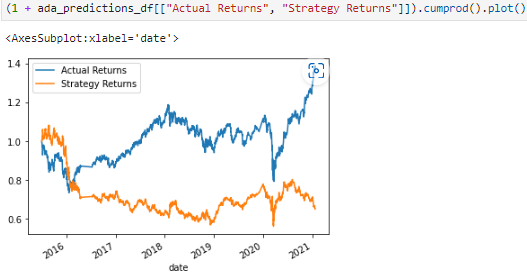
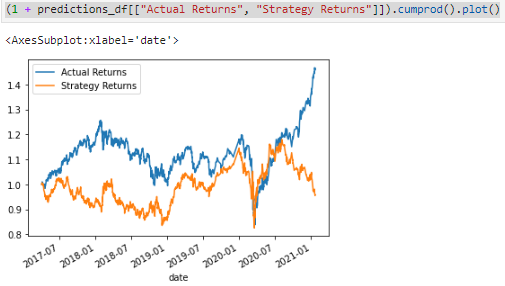
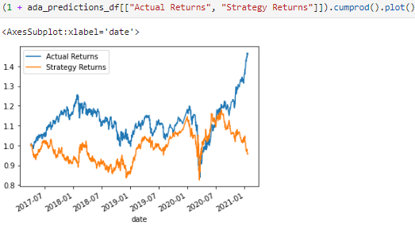

# Adaptive-Trading-Bot
Mod 14 Algo bot

## This is a comparison between two trading bot models

The baseline was done on a Support Vector Machine trained on 3 months of data and SMA's with 4 and 100 day windows.

The alternate model used an ADABoost classifier which trains and adds weights to get an improvement in accuracy.

### Adjustments made

I did a lot of fine tuning with the baseline model initially but each small adjustment had minimal effect and no visible improvement on the baseline.

Minor tuning was to vary the training dataset size from 2 months 4 months and 6 months, but these had minor effects and no visible improvement.

Other changes were to vary the SMA window sizes up and down for both short and long. I tried each independantly then combined the variations that had the best result.

Some adjustments affected the model negatively, but none appeared to improve the baseline model not even the combined adjustments.

To compare the models I have some images of the Cumulative return Plot showing actual returns against strategy returns.

Baseline Model SVM
 

Tuned SVM model

### AdaBoost adjustments

I varied the number of estimators in the AdaBoost classifier model with minimal impact 

I then added an svc base_estimator which produced a small improvement in accuracy.

ADABoost model

### Strong correlation

My findings were that with this dataset, both models performed approximately the same. Neither stood out as a better model.

### Biggest improvement found.

The single most dramatic improvement I made with the models was to change the training data size from 3 months to 2 years.

The reason for the dramatic adjustment was to incorporate a better balance of market behaviours in the training data.

Again both models maintained a correlation to one another, meaning both had a significant improvement in performance.

24 Month SVM model
 

24 Month AdaBoost model
